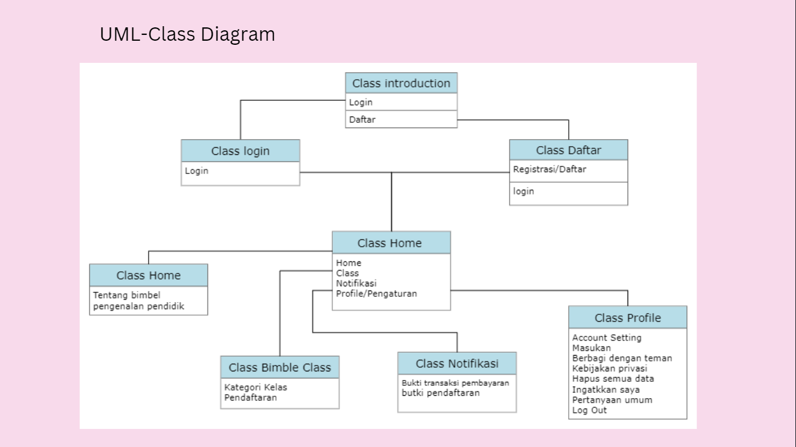

# Requirements

- Pendahuluan: Deskripsi singkat tentang aplikasi Bimble yang bertujuan untuk mendidik karakter anak yang dikarenakan orang tua nya sibuk.
- Tujuan: Tujuan dari aplikasi ini adalah untuk meningkatkan karakter anak melalui interaksi yang menyenangkan dan menarik.
- Fitur-fitur:
Game interaktif yang dirancang khusus untuk anak usia dini
Video pendidikan yang menyenangkan dan bermanfaat
Kuis untuk menguji pengetahuan anak
Sistem reward untuk memotivasi anak belajar
Konten yang dapat disesuaikan dengan usia anak
- Teknologi: Aplikasi ini dikembangkan menggunakan Unity dan dioptimalkan untuk perangkat mobile.
- Target pengguna: Aplikasi ini ditujukan untuk anak dan orang tua yang sibuk.
- Kebutuhan sumber daya: Aplikasi ini memerlukan akses internet untuk mengunduh konten dan dapat dijalankan pada perangkat mobile dengan spesifikasi yang cukup.
- Rencana pengembangan: Aplikasi ini akan diperbarui secara berkala dengan konten baru dan fitur-fitur yang dapat membantu dalam proses pendidikan anak.
- Dokumentasi: Dokumentasi aplikasi ini akan disediakan dalam bentuk manual pengguna dan panduan pengembangan untuk developer.

# UML

- Class Diagram

some caption.

